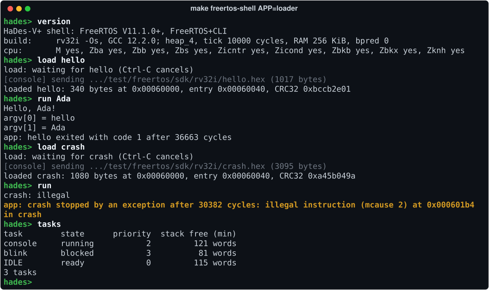

[instrguide]:https://repository.tugraz.at/oer/nytm4-grv34
[lvref]:https://online.tugraz.at/tug_online/wbLv.wbShowLVDetail?pStpSpNr=525082
[basys]:https://digilent.com/reference/programmable-logic/basys-3/reference-manual?redirect=1
[upstream]:https://github.com/tscheipel/HaDes-V


# HaDes-V+ — An Extended RISC-V Soft Core

[](https://www.credly.com/badges/a78e3644-1597-450d-8020-f03662391719/public_url)
[](docs/ARCHITECTURE.md#instruction-set)
[](docs/FREERTOS.md)
[](docs/ARCHITECTURE.md#clocks--reset)
[](docs/BUILDING.md#building-running-and-debugging)
[](#license)

**A 32-bit RISC-V soft core in SystemVerilog that runs unmodified FreeRTOS with an interactive shell, and loads and runs programs built on the PC.**

HaDes-V+ extends the [HaDes-V][lvref] teaching core of Graz University of Technology, a classic in-order, five-stage pipeline, to **`rv32imb_zicntr_zicond_zicsr_zifencei`** (B = Zba + Zbb + Zbs) in machine mode with a branch predictor. It targets the Digilent [Basys3][basys] (Xilinx Artix-7 `xc7a35tcpg236-1`) at 50 MHz: it boots bare-metal C, takes interrupts, drives the board's LEDs, seven-segment display and VGA output, reads its switches and buttons, communicates over a UART, and loads programs through a UART bootloader. The sessions below run on a cycle-accurate Verilator model of the complete microcontroller, and every result quoted on this page has a record under [results/](results/README.md).

<p align="center"><b><a href="#quick-start">Quick Start</a> · <a href="docs/README.md">Documentation</a> · <a href="docs/VERIFICATION.md">Verification</a> · <a href="results/README.md">Recorded Results</a></b></p>

<p align="center"></p>
<p align="center"><sub>A session of <code>make freertos-shell</code>: FreeRTOS V11.1.0+ with FreeRTOS+CLI on the simulated core, its UART connected to the terminal. Recorded from a real run by <a href="docs/tools/screenshots.py"><code>docs/tools/screenshots.py</code></a>.</sub></p>

## What HaDes-V+ Can Do

### FreeRTOS with a Live Shell

The unmodified official RISC-V port of FreeRTOS V11.1.0+ runs on the core in machine mode. `make freertos-shell` starts a FreeRTOS+CLI command shell and connects the simulated UART to your terminal: you type into the running core as into a board's serial console, and the commands show the tasks with their stacks and CPU time, the heap, the cycle and instruction counters and the branch predictor's statistics, and execute the M and Zba instructions. The FreeRTOS standard demo task set passes as well, after 150,681,199 cycles ([record](results/tests/2026-10-01_03386fd/RECORD.md)). Guides: [the shell](docs/SHELL.md), [FreeRTOS on HaDes-V+](docs/FREERTOS.md).

### Programs Built on the PC, Loaded and Run

A program compiled on the PC with the project's GCC and a small SDK is sent to the running shell over the UART and runs there as a FreeRTOS task: `load hello` transfers it, `run Ada` starts it with its arguments. An app that raises an exception or overflows its stack is stopped and reported while the shell carries on, and Ctrl-C stops one that hangs. The example app `bitmanip`, built for `rv32im_zba_zbb_zbs`, puts every Zbb, Zbs and Zicond instruction to work and passes the same self-checks as its RV32I build. Guide: [building, loading and running apps](docs/APPS.md); specification: [SPEC.md](test/freertos/loader/SPEC.md).

<p align="center"></p>
<p align="center"><sub><code>make freertos-shell APP=loader</code>: the example app <code>hello</code> is loaded and run with an argument; <code>crash</code> executes an illegal instruction, and the shell reports it and carries on.</sub></p>

### An Extended CPU

The upstream core implements **RV32I + Zicsr** (its `FENCE.I` was present but untested). HaDes-V+ adds, as [EXTENSIONS.md](docs/EXTENSIONS.md) describes in detail:

| Extension | What it adds |
|---|---|
| **M** | Multiply and divide: all eight instructions, with a 2-cycle multiply and a 34-cycle divider ([record](results/m-unit-cycles/2026-10-01_03386fd/RECORD.md)) |
| **Zba** | Address generation: `sh1add`, `sh2add`, `sh3add`, which GCC emits for array indexing; 20.3&nbsp;% fewer cycles in a best-case loop at `-O2` ([record](results/zba/2026-10-01_03386fd/RECORD.md)) |
| **Zbb**, **Zbs** | Bit manipulation: leading and trailing zeros, population count, `min`/`max`, sign and zero extension, `andn`/`orn`/`xnor`, rotates, byte operations, and single-bit set, clear, invert and extract, all single-cycle; GCC emits most of them from plain C; 59.8&nbsp;% fewer cycles in a best-case loop at `-O2` ([record](results/zbb/2026-10-02_e75223e/RECORD.md)). With Zba, Zbb and Zbs, HaDes-V+ implements the ratified **B** extension (B = Zba + Zbb + Zbs) |
| **Zicond** | Conditional zero: `czero.eqz`, `czero.nez`, a select without a branch, usable from C through [`zicond.h`](std/include/zicond.h) |
| **Zicntr** | User counters: `cycle`, `time`, `instret` and their high halves, with `time` shadowing the memory-mapped `mtime` |
| **Zifencei** | Fetch synchronisation: `FENCE.I`, now tested, and the 3-slot staleness window that it closes measured ([record](results/fencei-window/2026-10-01_03386fd/RECORD.md)) |
| **Branch predictor** | Never-taken, always-taken, backward-taken or bimodal 2-bit counters, selected at run time, with four outcome counters as CSRs |

<p align="center"></p>
<p align="center"><sub>The <code>make freertos-shell</code> session continued: the M extension's overflow case <code>-2^31 / -1</code>, which does not trap; the branch predictor switched to its bimodal algorithm at run time, with its outcome counters; the cycle, instruction and Zicntr counters; and <code>halt</code>, which ends the simulation with the program's verdict.</sub></p>

### Verification in Depth

Its behaviour is compared with the upstream project's reference implementation — the *golden* CPU and pipeline stages, shipped as precompiled libraries in [`ref/`](ref) — and checked by an independent instruction-set model and, for the multiply/divide unit, by a formal proof:

- **Golden models:** the Decode stage, including forwarding and hazards, matches the golden Decode stage in 11,026 checks, and the instruction decoder matches the golden decoder in 486,896 checks of every opcode, `funct3` and `funct7` combination, every immediate and `rs2` field of the arithmetic opcodes and 150,000 random words, apart from the new M, Zba, Zbb, Zbs and Zicond encodings, which must decode to exactly their own operations ([record](results/tests/2026-10-01_03386fd/RECORD.md)).
- **Bit manipulation against models of the ISA text:** the golden models cannot check Zbb, Zbs and Zicond, so the decoder and Execute stage are compared with a C model written from the ratified text: every one of the 28 instruction forms on corner and random operands, and the eight one-operand instructions on all 2^32 inputs, 34,376,492,288 results in all, identical; 1,000 random programs replayed by the instruction-set model agree ([record](results/bitmanip/2026-10-02_e75223e/RECORD.md)).
- **Independent ISA model:** interrupts swept over every cycle offset around 532 distinct trap-relevant instruction sequences, each run replayed by a Python model of the microcontroller: 61 of 61 programs consistent ([record](results/trapsweep/2026-10-01_03386fd/RECORD.md)).
- **FreeRTOS differential campaign:** 794 of 794 runs passed on HaDes-V+, 102 of them with the branch predictor on, and all 523 twin runs on the golden CPU agreed ([record](results/freertos-campaign/2026-10-01_03386fd/RECORD.md)).
- **Formal proof:** by k-induction, the multiply/divide unit produces the RISC-V result for all 2^64 operand pairs in every reachable state (`make formal`, 72 required checks; [record](results/formal/2026-09-28_588d76a/RECORD.md)). The proof was made before Zbb, Zbs and Zicond added their unit to the same file, `rtl/execute_stage.sv`; the multiply/divide code is unchanged, but the proof has not been re-run since.
- **Recorded results:** each of these results has a record with its command, inputs and output as printed, and `make check-results` re-runs the repeatable records and compares the output with the stored values.

The work found and fixed nine defects of the upstream design, six of them trap and interrupt defects exposed by FreeRTOS and the interrupt sweep ([record](results/history/2026-09-27_6b19d41/RECORD.md)). The results at a glance, the methods and every suite: [VERIFICATION.md](docs/VERIFICATION.md).

## Quick Start

**You need** Verilator 5 (tested with 5.042) and a `riscv32-unknown-elf` GCC toolchain with newlib-nano, installed in `/opt/riscv32i/bin`, the path the [Makefile](Makefile) uses ([check your tools](docs/FREERTOS.md#1-prerequisites)). Vivado is needed only for synthesis; the full list is under [Tools and Dependencies](docs/BUILDING.md#tools-and-dependencies).

```bash
git clone https://github.com/Sarkar22/hades-v-plus.git
cd hades-v-plus
make freertos-shell    # type 'help'; Ctrl-] or 'halt' quits
```

The first run builds the shell and its simulator, which takes up to a minute. After the build messages and a deliberate `Test fail!` start-up marker, the `hades>` prompt appears: type `help` for the list of commands; `halt` or Ctrl-] ends the simulation. For programs built on the PC, start `make freertos-shell APP=loader` and type `load hello`, then `run Ada`.

Build output goes to `build/`; to put it elsewhere, for example when the repository is on a disk that cannot execute programs, see [Building, Running, and Debugging](docs/BUILDING.md#building-running-and-debugging). The test suites, the formal proof and the other entry points: [First Commands](docs/README.md#first-commands).

## Documentation

| Goal | Read |
|---|---|
| Get started | [Quick Start](#quick-start), [BUILDING.md](docs/BUILDING.md) (tools, targets, synthesis), [FREERTOS.md](docs/FREERTOS.md) (running FreeRTOS) |
| Use it | [SHELL.md](docs/SHELL.md) (the interactive shell), [APPS.md](docs/APPS.md) (building, loading and running apps) |
| Understand it | [ARCHITECTURE.md](docs/ARCHITECTURE.md) (the core and the microcontroller), [EXTENSIONS.md](docs/EXTENSIONS.md) (what HaDes-V+ adds), [SPEC.md](test/freertos/loader/SPEC.md) (the app loader) |
| Check the evidence | [VERIFICATION.md](docs/VERIFICATION.md) (methods and results), [results/](results/README.md) (the record of each figure), [formal/README.md](formal/README.md) (the proof) |
| Find any document | [docs/README.md](docs/README.md): every document, with what it covers |

## Status and Limitations

- **Simulation first; not yet run on a board.** All results are from Verilator simulation and Vivado implementation. Programs that need more than the board's 32 KiB of RAM, such as the FreeRTOS standard demo set and the app loader (256 KiB each), run on a larger simulated RAM, which the board does not have.
- **FPGA timing at 50 MHz is marginal, and not measured since Zbb, Zbs and Zicond.** The RTL met timing with a worst negative slack of **+0.016 ns** (Vivado 2024.2), measured at commit cbae9b9 ([record](results/fpga-timing/2026-09-30_cbae9b9/RECORD.md)); small RTL changes move the worst path and its slack ([details](docs/BUILDING.md#synthesis-and-fpga-timing)). The bit-manipulation unit added to Execute since then has not been implemented: whether the core still meets 50 MHz with it is unknown.
- **Formal proof not re-run since Zbb, Zbs and Zicond.** The proof of the multiply/divide unit was made on `rtl/execute_stage.sv` of commit 588d76a ([record](results/formal/2026-09-28_588d76a/RECORD.md)). Zbb, Zbs and Zicond added their unit to the same file without changing the multiply/divide code, but `make formal` has not been run on the current file ([details](docs/VERIFICATION.md#formal-verification-of-the-m-unit)).
- **No memory protection.** The core runs in machine mode only, so an app has the same rights as the shell: exceptions, stack overflows that FreeRTOS detects, and Ctrl-C are contained, but an app that writes outside its memory or disables interrupts can stop the whole system ([details](docs/APPS.md#what-is-contained-and-what-is-not)).

## Origin

The upstream [HaDes-V][upstream] is an **Open Educational Resource** developed by [Tobias Scheipel](https://www.scheipel.com), David Beikircher, and Florian Riedl of the Embedded Architectures & Systems Group at Graz University of Technology, and released under the MIT and CC BY 4.0 licences. This repository preserves that work and its licences in full — see [Attribution and Upstream](#attribution-and-upstream). Everything described under [*Extensions*](docs/EXTENSIONS.md) is additional work by Emon Sarkar.

Development proceeded in two phases. The base core was implemented for the **RISC-V Community Challenge with HaDes-V**, a programme issued by The Linux Foundation, in which each pipeline module of a submitted design is assessed against a reference implementation. This submission scored full marks at every stage — 56/56 across Fetch, Decode, Register File, Instruction Decoder, Execute, Memory and Writeback ([record](results/history/2026-06-27_9fd9b18/RECORD.md)) — earning all three tiers: [Bronze](https://www.credly.com/badges/1f02699c-a9f7-4590-82f9-97f688cd0b7f/public_url), [Silver](https://www.credly.com/badges/6d03e72d-23fc-494a-bcad-b93a1da5c283/public_url) and [Gold](https://www.credly.com/badges/a78e3644-1597-450d-8020-f03662391719/public_url). The extensions catalogued below were developed subsequently and independently of the challenge.

HaDes-V originates as the lab project for [Microcontroller Design, Lab][lvref] at Graz University of Technology ([course material](docs/ARCHITECTURE.md#upstream-course-material)). **If you are taking that course, work from the [upstream template][upstream] rather than this repository.** It is the canonical starting point, and implementing the stages yourself is the entire point of the exercise. The upstream repository is also the canonical reference for the original teaching material.

## Attribution and Upstream

This repository is a derivative work. The HaDes-V core, its build system, the Wishbone peripheral fabric, the reference models in [`ref/`](ref), and the original documentation were created by **Tobias Scheipel, David Beikircher, and Florian Riedl** (Embedded Architectures & Systems Group, Graz University of Technology) and published as an Open Educational Resource. Their copyright notices are retained in every file they authored, and both upstream licences apply unchanged — see [License](#license) below. If you use this work academically, please cite the upstream authors' publication linked under [Publication](#publication--risc-v-summit-europe-2025).

The following are original contributions by **Emon Sarkar**, added after completing the upstream lab:

- The **M**, **Zba**, **Zbb**, **Zbs**, **Zicond** and **Zicntr** extensions, and the substantiation of **Zifencei**
- The **bimodal branch predictor** and its performance-counter CSRs
- Nine correctness fixes to the upstream design: decoder `rd` handling for S/B-type instructions, `FENCE` forwarding suppression in the Memory stage, six trap/interrupt defects found by running FreeRTOS and the trap sweep, and the UART's transmit-interrupt enable
- The formal proof of the multiply/divide unit ([`formal/`](formal))
- FreeRTOS support ([`test/freertos/`](test/freertos), [docs/FREERTOS.md](docs/FREERTOS.md)), including the interactive shell and its app loader, and the independent trap-sweep model ([`test/trapsweep/`](test/trapsweep))
- The test suites in [`test/asm/`](test/asm) and [`test/sv/`](test/sv) beyond the upstream set, including the golden-comparison, encoding-sweep, and adversarial suites
- Repairs to the synthesis flow ([`synth/synth.tcl`](synth/synth.tcl)) and the architectural documentation in this README and in [`docs/`](docs)

**Third-party component: FreeRTOS.** The directory [`third_party/freertos/`](third_party/freertos/README.md) contains unmodified sources of [FreeRTOS](https://www.freertos.org) — the FreeRTOS kernel with its RISC-V port, the FreeRTOS standard demo tasks, and FreeRTOS+CLI — taken from the [FreeRTOS-Kernel](https://github.com/FreeRTOS/FreeRTOS-Kernel) and [FreeRTOS](https://github.com/FreeRTOS/FreeRTOS) repositories at pinned commits. FreeRTOS is Copyright (C) Amazon.com, Inc. or its affiliates and is distributed under the MIT licence; it is neither part of the upstream HaDes-V work nor among the original contributions listed above. Its licence texts, the exact upstream commits and the complete list of vendored files are given in [third_party/freertos/README.md](third_party/freertos/README.md).

## License

This OER and all of its creative material (text, logos, etc.) is licensed under the **CC BY 4.0 International License**, allowing you to share and adapt the resource, provided appropriate credit is given. See the full license details [here](https://creativecommons.org/licenses/by/4.0/).

>\
>Tobias Scheipel, David Beikircher, Florian Riedl\
>TU Graz 2024

All the software files included in the repository are licensed under the **MIT License**. See the [LICENSE](./LICENSE) file for details. The third-party FreeRTOS code in [`third_party/freertos/`](third_party/freertos/README.md) is likewise MIT-licensed, but under its own licence and copyright (Amazon.com, Inc. or its affiliates); its licence texts are included in that directory.

Contributions to this OER are welcome and encouraged! The LaTeX sources for the [Instruction Guide][instrguide] can be requested as well. For more OERs, visit [https://www.scheipel.com/oer](https://www.scheipel.com/oer).

## Contact

For questions about the **extensions in this repository** (M, Zba, Zbb, Zbs, Zicond, Zicntr, the branch predictor, or the verification work), please open an issue here.

For questions about the **upstream HaDes-V project**, its licensing, or the closed-source test-bench system, contact the original authors:
- **Email**: [tobias.scheipel@tugraz.at](mailto:tobias.scheipel@tugraz.at)
- **Website**: [https://www.scheipel.com/oer](https://www.scheipel.com/oer)

## Publication @ RISC-V Summit Europe 2025
The upstream authors published the HaDes-V OER at the [RISC-V Summit Europe 2025](https://riscv-europe.org/summit/2025/) as a [Poster](https://graz.elsevierpure.com/files/93678000/HaDes_V_Poster-CR_v1.pdf) and an extended [Abstract Paper](https://www.scheipel.com/wp-content/uploads/2025/05/HaDes_V_RISC_V_Summit_camera_ready.pdf). 

It was also featured on the official RISC-V International [Blog](https://riscv.org/blog/2025/05/hades-v-learning-by-puzzling-a-modular-approach-to-risc-v-processor-design-education/). Please cite that work rather than this repository when referring to the HaDes-V architecture itself.
