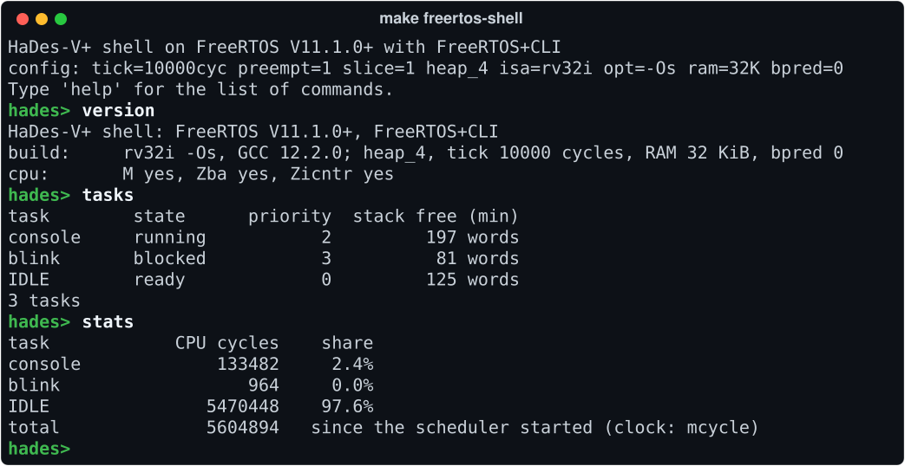
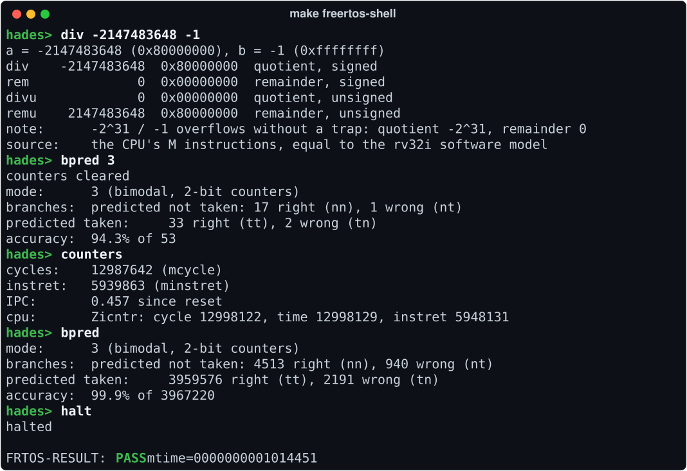

[instrguide]:https://repository.tugraz.at/oer/nytm4-grv34
[lvref]:https://online.tugraz.at/tug_online/wbLv.wbShowLVDetail?pStpSpNr=525082
[vivado]:https://www.xilinx.com/support/download.html
[verilator]:https://verilator.org
[basys]:https://digilent.com/reference/programmable-logic/basys-3/reference-manual?redirect=1
[upstream]:https://github.com/tscheipel/HaDes-V


# HaDes-V+ — An Extended RISC-V Soft Core

[](https://www.credly.com/badges/a78e3644-1597-450d-8020-f03662391719/public_url)
[](docs/ARCHITECTURE.md#instruction-set)
[](docs/FREERTOS.md)
[](docs/ARCHITECTURE.md#clocks--reset)
[](docs/BUILDING.md#building-running-and-debugging)
[](#license)

**HaDes-V+** is an extended version of the [HaDes-V][lvref] 32-bit RISC-V soft core: a classic in-order, five-stage pipeline written in SystemVerilog, targeting the Digilent [Basys3][basys] (Xilinx Artix-7 `xc7a35tcpg236-1`) at 50 MHz. It boots bare-metal C, takes interrupts, drives the board's LEDs, seven-segment display and VGA output, reads its switches and buttons, communicates over a UART, and loads programs through a UART bootloader. It has not yet been run on a physical board (see [Status and Limitations](#status-and-limitations)).

It implements **`rv32im_zba_zicsr_zifencei_zicntr`** in machine mode, adds a branch predictor, and runs the unmodified official RISC-V port of **FreeRTOS** V11.1.0+, including an interactive command shell that is typed into from a terminal while the simulated core runs. Its behaviour is compared with the upstream project's reference implementation — the *golden* CPU and pipeline stages, shipped as precompiled libraries in [`ref/`](ref) — and checked by an independent instruction-set model and, for the multiply/divide unit, by a formal proof.

<p align="center">
  
</p>
<p align="center"><sub>A session of <code>make freertos-shell</code>: FreeRTOS V11.1.0+ with FreeRTOS+CLI on the simulated HaDes-V+ core, its UART connected to the terminal. The program is compiled for RV32I; <code>version</code> shows the M, Zba and Zicntr extensions, which the shell detects when it starts and which its <code>mul</code>, <code>div</code>, <code>zba</code> and <code>counters</code> commands then execute directly. Recorded from a real run by <a href="docs/tools/screenshots.py"><code>docs/tools/screenshots.py</code></a>.</sub></p>

## Quick Start

**You need** Verilator 5 (tested with 5.042) and a `riscv32-unknown-elf` GCC toolchain with newlib-nano, installed in `/opt/riscv32i/bin`, the path the [Makefile](Makefile) uses ([check your tools](docs/FREERTOS.md#1-prerequisites)). Vivado is needed only for synthesis; the full list is under [Tools and Dependencies](docs/BUILDING.md#tools-and-dependencies).

```bash
git clone https://github.com/Sarkar22/hades-v-plus.git
cd hades-v-plus
make freertos-shell    # type 'help'; Ctrl-] or 'halt' quits
```

Build output goes to `build/`; to put it elsewhere, for example when the repository is on a disk that cannot execute programs, see [Building, Running, and Debugging](docs/BUILDING.md#building-running-and-debugging).

The first run builds the shell and its simulator, which takes up to a minute. After the build messages and a deliberate `Test fail!` start-up marker, the `hades>` prompt appears: type `help` for the list of commands; `halt` or Ctrl-] ends the simulation. The commands run on the simulated core and exercise the hardware directly:

<p align="center">
  
</p>
<p align="center"><sub>The same session: the M extension's overflow case <code>-2^31 / -1</code>, which does not trap; the branch predictor switched to its bimodal algorithm at run time, with its outcome counters; the cycle, instruction and Zicntr counters; and <code>halt</code>, which ends the simulation with the program's verdict.</sub></p>

Other entry points:

```bash
make test/asm/ops                    # every RV32I instruction, self-checking
make test/c/m_extension              # M hardware against libgcc's software routines
make test/sv/test_decode_exhaustive  # 11,026 checks against the golden Decode stage
make formal                          # formal proof of the M unit; tools: formal/README.md
make freertos APP=minimal            # boot FreeRTOS (guide: docs/FREERTOS.md)
make synthesis                       # implement for the Basys3 (needs Vivado)
make help                            # the main targets and their settings
```

## Origin

The upstream [HaDes-V][upstream] is an **Open Educational Resource** developed by [Tobias Scheipel](https://www.scheipel.com), David Beikircher, and Florian Riedl of the Embedded Architectures & Systems Group at Graz University of Technology, and released under the MIT and CC BY 4.0 licences. This repository preserves that work and its licences in full — see [Attribution and Upstream](#attribution-and-upstream). Everything described under [*Extensions*](docs/EXTENSIONS.md) is additional work by Emon Sarkar.

Development proceeded in two phases. The base core was implemented for the **RISC-V Community Challenge with HaDes-V**, a programme issued by The Linux Foundation, in which each pipeline module of a submitted design is assessed against a reference implementation. This submission scored full marks at every stage — 56/56 across Fetch, Decode, Register File, Instruction Decoder, Execute, Memory and Writeback ([record](results/history/2026-06-27_9fd9b18/RECORD.md)) — earning all three tiers: [Bronze](https://www.credly.com/badges/1f02699c-a9f7-4590-82f9-97f688cd0b7f/public_url), [Silver](https://www.credly.com/badges/6d03e72d-23fc-494a-bcad-b93a1da5c283/public_url) and [Gold](https://www.credly.com/badges/a78e3644-1597-450d-8020-f03662391719/public_url). The extensions catalogued below were developed subsequently and independently of the challenge.

## What HaDes-V+ Adds

The upstream core implements **RV32I + Zicsr** (its `FENCE.I` was present but untested). This version extends it to **`rv32im_zba_zicsr_zifencei_zicntr`** and adds a branch predictor:

| Addition | Summary | Detail |
|---|---|---|
| **M** — multiply/divide | All eight instructions. 2-cycle registered multiply, 34-cycle restoring divider ([record](results/m-unit-cycles/2026-10-01_03386fd/RECORD.md)), and the first self-generated stall in the Execute stage | [§](docs/EXTENSIONS.md#m--multiply-and-divide) |
| **Zba** — address generation | `sh1add`/`sh2add`/`sh3add`, which replace the `slli` + `add` pair of a scaled array index; GCC emits them for ordinary indexing code when it optimises (`-O2`, `-Os`) | [§](docs/EXTENSIONS.md#zba--scaled-index-address-generation) |
| **Zicntr** — user counters | `cycle`, `time`, `instret` (+ high halves), with `time` shadowing the real memory-mapped `mtime` | [§](docs/EXTENSIONS.md#zicntr--user-mode-counters) |
| **Zifencei** — documented & tested | `FENCE.I` was implemented but never actually verified upstream; now tested ([fencei.s](test/asm/fencei.s)), and the 3-slot staleness window that it closes is measured (`make bench-fencei-window`, [record](results/fencei-window/2026-10-01_03386fd/RECORD.md)) | [§](docs/EXTENSIONS.md#zifencei--instruction-fetch-synchronisation) |
| **Branch predictor** | Four run-time selectable algorithms — never-taken (the reset default), always-taken, backward-taken and bimodal 2-bit counters — with four outcome counters as CSRs; a correctly predicted branch causes no pipeline flush | [§](docs/EXTENSIONS.md#branch-predictor-extension) |
| **FreeRTOS** | The official RISC-V port boots unmodified; one-command build and run, a differential stress campaign against the golden CPU, a template for your own programs, and an interactive command shell (FreeRTOS+CLI) you type into from your terminal. In simulation, the shell can also receive programs compiled on the host over the UART and run them as a task (`make freertos-shell APP=loader UPLOAD=hello`, then `load` and `run`); an app that raises an exception is stopped and reported while the shell carries on, as far as machine mode without memory protection allows ([guide](docs/FREERTOS.md#10-load-and-run-programs-on-the-shell)) | [§](docs/FREERTOS.md) |

Nine correctness fixes to the upstream design are also included. Two predate the RTOS work: a decoder defect that corrupted registers on stores and branches (which prevented the bootloader from running at all), and a forwarding defect that leaked a garbage value for `FENCE` instructions carrying a non-zero reserved field. Six are trap and interrupt defects: four exposed by running FreeRTOS under randomised interrupt timing, and two by the interrupt-offset sweep against the independent instruction-set model ([record](results/history/2026-09-27_6b19d41/RECORD.md)); see [the defects and their regression tests](docs/VERIFICATION.md#freertos-differential-campaigns). The ninth is in the UART: a byte store to a status byte drove the transmit interrupt from the wrong enable bit for one cycle, which could raise an interrupt without a source ([test/asm/uartirq.s](test/asm/uartirq.s)).

## Verification at a Glance

Each result below summarises what the command prints in this version of the repository; the formal result is the recorded run in [formal/README.md](formal/README.md#4-results-and-runtimes), made on the same RTL. A *differential* run executes the same program, with the same randomised interrupt timing, on HaDes-V+ and on the golden CPU, and compares the verdicts. [docs/VERIFICATION.md](docs/VERIFICATION.md) describes the methods and lists every self-checking suite with its result.

[results/](results/README.md) holds a record of each of these results and of the other figures that the documentation quotes: the command, the inputs, the output as printed, and whether it can be re-run (its index also names the few approximate figures that have none). `make check-results` re-runs the repeatable records and compares their output with the stored values.

| Check | Command | Result | Record |
|---|---|---|---|
| Every RV32I instruction, self-checking | `make test/asm/ops` | `All tests passed!` | [record](results/tests/2026-10-01_03386fd/RECORD.md) |
| Decode stage, including forwarding and hazards, against the golden Decode stage | `make test/sv/test_decode_exhaustive` | 11,026 checks, all equal | [record](results/tests/2026-10-01_03386fd/RECORD.md) |
| Decoder sweep: every opcode × funct3 × funct7 combination and 150,000 random words decode as in the golden decoder, except the new M and Zba encodings, which must decode to exactly their own operations | `make test/sv/test_zba_encoding_sweep` | 290,288 checks passed | [record](results/tests/2026-10-01_03386fd/RECORD.md) |
| M unit: all eight instructions and the stall protocol | `make test/sv/test_m_execute` | 6,268 checks passed | [record](results/tests/2026-10-01_03386fd/RECORD.md) |
| M instructions against libgcc's software routines | `make test/c/m_extension` | `M-EXT PASS` after 200 checks; the testbench's summary line then reads `Inital test failed! (# Errors: 0)` ([why](docs/VERIFICATION.md#the-testbenchs-verdict-line)) | [record](results/tests/2026-10-01_03386fd/RECORD.md) |
| Interrupts swept over every cycle offset, checked by an independent instruction-set model | `python3 test/trapsweep/sweep.py run` | 61 of 61 programs consistent | [record](results/trapsweep/2026-10-01_03386fd/RECORD.md) |
| FreeRTOS differential campaign on HaDes-V+ and the golden CPU | `make freertos-stress` | 28 of 28 runs `PASS` | [record](results/freertos-validate/2026-10-01_03386fd/RECORD.md) |
| FreeRTOS standard demo task set | `make freertos APP=full` | `PASS` after 150,681,199 cycles | [record](results/tests/2026-10-01_03386fd/RECORD.md) |
| Scripted shell session; the same session on the golden CPU | `make freertos-shell-test`, `make freertos-shell-compare` | 120 of 120 expectations met; transcripts `SAME` | [record](results/tests/2026-10-01_03386fd/RECORD.md) |
| Formal proof, by k-induction, that the multiply/divide unit computes the RISC-V result for all operand pairs | `make formal` | `FORMAL RESULT: PASS`, 72 required checks ([recorded run](formal/README.md#4-results-and-runtimes)) | [record](results/formal/2026-09-28_588d76a/RECORD.md) |

Four comparisons of single pipeline stages with the golden stages report a fixed number of expected differences, each explained under [Known Divergences](docs/VERIFICATION.md#known-divergences). The tests are themselves checked by [mutation testing](docs/VERIFICATION.md#mutation-testing): each trap and interrupt fix, reverted on its own, makes its regression test fail and the interrupt sweep flag programs ([record](results/history/2026-09-27_6b19d41/RECORD.md)).

## Documentation

| Document | Contents |
|---|---|
| [docs/FREERTOS.md](docs/FREERTOS.md) | Running FreeRTOS: setup, the programs, comparison with the golden CPU, the stress campaign, writing a program, the interactive shell, loading programs into it, all settings |
| [docs/ARCHITECTURE.md](docs/ARCHITECTURE.md) | The core: instruction set, pipeline, hazards; memory map, Wishbone fabric, peripherals, clocks; software runtime; the reference-library flow |
| [docs/EXTENSIONS.md](docs/EXTENSIONS.md) | M, Zba, Zicntr, Zifencei and the branch predictor: design, verification, implementation notes |
| [docs/VERIFICATION.md](docs/VERIFICATION.md) | Approach, every self-checking suite with its result, test hierarchy, trap sweep, FreeRTOS campaigns, formal proof, mutation testing, known divergences |
| [docs/BUILDING.md](docs/BUILDING.md) | Tools, build targets, waveforms, synthesis and timing, the screenshots, repository structure |
| [formal/README.md](formal/README.md) | The formal proof of the multiply/divide unit in full |
| [test/freertos/README.md](test/freertos/README.md) | The FreeRTOS programs and the differential campaign in depth |
| [test/trapsweep/README.md](test/trapsweep/README.md) | The interrupt-offset sweeps and the independent ISA model |
| [test/bench/README.md](test/bench/README.md) | The measurement programs behind the Zba, M-unit and `FENCE.I` figures |
| [results/README.md](results/README.md) | The records of the figures quoted in the documentation, and how to re-run them |
| [third_party/freertos/README.md](third_party/freertos/README.md) | Provenance and licence of the vendored FreeRTOS sources |

## Status and Limitations

- **FPGA timing at 50 MHz is marginal.** The RTL meets timing with a worst negative slack of **+0.016 ns** (Vivado 2024.2; a repeated run gives the same result), measured at commit cbae9b9; the current RTL differs from it only by the one-line UART fix and has not itself been implemented ([record](results/fpga-timing/2026-09-30_cbae9b9/RECORD.md)). Its worst path runs from the block RAM's read port through the branch predictor to the Fetch PC, within half a clock period. The commit that added the M extension missed timing by 0.120 ns on a different path, from the Memory stage's instruction register to `mcause` ([record](results/fpga-timing/2026-08-18_c00c4db/RECORD.md)): small RTL changes move the worst path and its slack. See [Synthesis and FPGA Timing](docs/BUILDING.md#synthesis-and-fpga-timing).
- **Not yet validated on physical hardware.** All results are from Verilator simulation and Vivado implementation.
- **Simulation first.** The programs (assembly, C, FreeRTOS and the shell) run on a cycle-accurate Verilator model of the complete microcontroller; the module benches simulate single pipeline stages. The simulated RAM is the board's 32 KiB by default; programs that need more (the FreeRTOS standard demo set uses 256 KiB) run with a larger simulated RAM, which the board does not have.

## Upstream Course Material

HaDes-V originates as the lab project for [Microcontroller Design, Lab][lvref] at Graz University of Technology, where students implement each pipeline stage themselves and validate it against the reference models in [`ref/`](ref) — the flow described under [Reference-Library](docs/ARCHITECTURE.md#reference-library-jigsaw-puzzle-flow). The upstream project provides the staged exercises — basic pipeline implementation, then memory/writeback and CSRs, then a free-form extension project — together with an [Instruction Guide][instrguide] (exercise instructions are in its Chapter 4) and a closed-source test-bench system, available to educators for teaching purposes on request (see [Contact](#contact)).

**If you are taking that course, work from the [upstream template][upstream] rather than this repository.** It is the canonical starting point, and implementing the stages yourself is the entire point of the exercise. The upstream repository is also the canonical reference for the original teaching material.

## Attribution and Upstream

This repository is a derivative work. The HaDes-V core, its build system, the Wishbone peripheral fabric, the reference models in [`ref/`](ref), and the original documentation were created by **Tobias Scheipel, David Beikircher, and Florian Riedl** (Embedded Architectures & Systems Group, Graz University of Technology) and published as an Open Educational Resource. Their copyright notices are retained in every file they authored, and both upstream licences apply unchanged — see [License](#license) below. If you use this work academically, please cite the upstream authors' publication linked under [Publication](#publication--risc-v-summit-europe-2025).

The following are original contributions by **Emon Sarkar**, added after completing the upstream lab:

- The **M**, **Zba**, and **Zicntr** extensions, and the substantiation of **Zifencei**
- The **bimodal branch predictor** and its performance-counter CSRs
- Nine correctness fixes to the upstream design: decoder `rd` handling for S/B-type instructions, `FENCE` forwarding suppression in the Memory stage, six trap/interrupt defects found by running FreeRTOS and the trap sweep, and the UART's transmit-interrupt enable
- The formal proof of the multiply/divide unit ([`formal/`](formal))
- FreeRTOS support ([`test/freertos/`](test/freertos), [docs/FREERTOS.md](docs/FREERTOS.md)) and the independent trap-sweep model ([`test/trapsweep/`](test/trapsweep))
- The test suites in [`test/asm/`](test/asm) and [`test/sv/`](test/sv) beyond the upstream set, including the golden-comparison, encoding-sweep, and adversarial suites
- Repairs to the synthesis flow ([`synth/synth.tcl`](synth/synth.tcl)) and the architectural documentation in this README and in [`docs/`](docs)

**Third-party component: FreeRTOS.** The directory [`third_party/freertos/`](third_party/freertos/README.md) contains unmodified sources of [FreeRTOS](https://www.freertos.org) — the FreeRTOS kernel with its RISC-V port, the FreeRTOS standard demo tasks, and FreeRTOS+CLI — taken from the [FreeRTOS-Kernel](https://github.com/FreeRTOS/FreeRTOS-Kernel) and [FreeRTOS](https://github.com/FreeRTOS/FreeRTOS) repositories at pinned commits. FreeRTOS is Copyright (C) Amazon.com, Inc. or its affiliates and is distributed under the MIT licence; it is neither part of the upstream HaDes-V work nor among the original contributions listed above. Its licence texts, the exact upstream commits and the complete list of vendored files are given in [third_party/freertos/README.md](third_party/freertos/README.md).

## License

This OER and all of its creative material (text, logos, etc.) is licensed under the **CC BY 4.0 International License**, allowing you to share and adapt the resource, provided appropriate credit is given. See the full license details [here](https://creativecommons.org/licenses/by/4.0/).

>\
>Tobias Scheipel, David Beikircher, Florian Riedl\
>TU Graz 2024

All the software files included in the repository are licensed under the **MIT License**. See the [LICENSE](./LICENSE) file for details. The third-party FreeRTOS code in [`third_party/freertos/`](third_party/freertos/README.md) is likewise MIT-licensed, but under its own licence and copyright (Amazon.com, Inc. or its affiliates); its licence texts are included in that directory.

Contributions to this OER are welcome and encouraged! The LaTeX sources for the [Instruction Guide][instrguide] can be requested as well. For more OERs, visit [https://www.scheipel.com/oer](https://www.scheipel.com/oer).

## Contact

For questions about the **extensions in this repository** (M, Zba, Zicntr, the branch predictor, or the verification work), please open an issue here.

For questions about the **upstream HaDes-V project**, its licensing, or the closed-source test-bench system, contact the original authors:
- **Email**: [tobias.scheipel@tugraz.at](mailto:tobias.scheipel@tugraz.at)
- **Website**: [https://www.scheipel.com/oer](https://www.scheipel.com/oer)

## Publication @ RISC-V Summit Europe 2025
The upstream authors published the HaDes-V OER at the [RISC-V Summit Europe 2025](https://riscv-europe.org/summit/2025/) as a [Poster](https://graz.elsevierpure.com/files/93678000/HaDes_V_Poster-CR_v1.pdf) and an extended [Abstract Paper](https://www.scheipel.com/wp-content/uploads/2025/05/HaDes_V_RISC_V_Summit_camera_ready.pdf). 

It was also featured on the official RISC-V International [Blog](https://riscv.org/blog/2025/05/hades-v-learning-by-puzzling-a-modular-approach-to-risc-v-processor-design-education/). Please cite that work rather than this repository when referring to the HaDes-V architecture itself.
